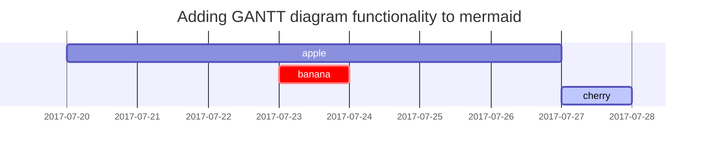

> 이 포스트는 Chirpy에서 제공하는 마크다운 문법을 어떻게 작성하고 렌더링되는지 정리한 글이다. [원본글](https://chirpy.cotes.page/posts/text-and-typography/)은 자세한 사용방법이 따로 나와있지 않다.
{: .prompt-info}

## Headings

# H1 - heading

{: .mt-4 .mb-0 }
```md
<!-- 사용법 -->
# H1 - heading

{: .mt-4 .mb-0 }
```

## H2 - heading

{: data-toc-skip='' .mt-4 .mb-0 }
```md
<!-- 사용법 -->
## H2 - heading

{: data-toc-skip='' .mt-4 .mb-0 }
```

### H3 - heading

{: data-toc-skip='' .mt-4 .mb-0 }
```md
<!-- 사용법 -->
### H3 - heading

{: data-toc-skip='' .mt-4 .mb-0 }
```

#### H4 - heading

{: data-toc-skip='' .mt-4 }
```md
<!-- 사용법 -->
#### H4 - heading

{: data-toc-skip='' .mt-4 }
```

## Paragraph

Quisque egestas convallis ipsum, ut sollicitudin risus tincidunt a. Maecenas interdum malesuada egestas. Duis consectetur porta risus, sit amet vulputate urna facilisis ac. Phasellus semper dui non purus ultrices sodales. Aliquam ante lorem, ornare a feugiat ac, finibus nec mauris. Vivamus ut tristique nisi. Sed vel leo vulputate, efficitur risus non, posuere mi. Nullam tincidunt bibendum rutrum. Proin commodo ornare sapien. Vivamus interdum diam sed sapien blandit, sit amet aliquam risus mattis. Nullam arcu turpis, mollis quis laoreet at, placerat id nibh. Suspendisse venenatis eros eros.
```md
<!-- 사용법 -->
Quisque egestas convallis ipsum, ut sollicitudin risus tincidunt a. Maecenas interdum malesuada egestas. Duis consectetur porta risus, sit amet vulputate urna facilisis ac. Phasellus semper dui non purus ultrices sodales. Aliquam ante lorem, ornare a feugiat ac, finibus nec mauris. Vivamus ut tristique nisi. Sed vel leo vulputate, efficitur risus non, posuere mi. Nullam tincidunt bibendum rutrum. Proin commodo ornare sapien. Vivamus interdum diam sed sapien blandit, sit amet aliquam risus mattis. Nullam arcu turpis, mollis quis laoreet at, placerat id nibh. Suspendisse venenatis eros eros.
```

## Lists

### Ordered list

1. Firstly
2. Secondly
3. Thirdly

```md
<!-- 사용법 -->
1. Firstly
2. Secondly
3. Thirdly
```

### Unordered list

- Chapter
  - Section
    - Paragraph

```md
<!-- 사용법 -->
- Chapter
  - Section
    - Paragraph
```

### ToDo list

- [ ] Job
  - [x] Step 1
  - [x] Step 2
  - [ ] Step 3

```md
<!-- 사용법 -->
- [ ] Job
  - [x] Step 1
  - [x] Step 2
  - [ ] Step 3
```

### Description list

Sun
: the star around which the earth orbits

Moon
: the natural satellite of the earth, visible by reflected light from the sun

```md
<!-- 사용법 -->
Sun
: the star around which the earth orbits

Moon
: the natural satellite of the earth, visible by reflected light from the sun
```

## Block Quote

> This line shows the _block quote_.

```md
<!-- 사용법 -->
> This line shows the _block quote_.
```

## Prompts

> An example showing the `tip` type prompt.
{: .prompt-tip }

```md
<!-- 사용법 -->
> An example showing the `tip` type prompt.
{: .prompt-tip }
```

> An example showing the `info` type prompt.
{: .prompt-info }

```md
<!-- 사용법 -->
> An example showing the `info` type prompt.
{: .prompt-info }
```

> An example showing the `warning` type prompt.
{: .prompt-warning }

```md
<!-- 사용법 -->
> An example showing the `warning` type prompt.
{: .prompt-warning }
```

> An example showing the `danger` type prompt.
{: .prompt-danger }

```md
<!-- 사용법 -->
> An example showing the `danger` type prompt.
{: .prompt-danger }
```

## Tables

| Company                      | Contact          | Country |
| :--------------------------- | :--------------- | ------: |
| Alfreds Futterkiste          | Maria Anders     | Germany |
| Island Trading               | Helen Bennett    |      UK |
| Magazzini Alimentari Riuniti | Giovanni Rovelli |   Italy |

```md
<!-- 사용법 -->
| Company                      | Contact          | Country |
| :--------------------------- | :--------------- | ------: |
| Alfreds Futterkiste          | Maria Anders     | Germany |
| Island Trading               | Helen Bennett    |      UK |
| Magazzini Alimentari Riuniti | Giovanni Rovelli |   Italy |
```

## Links

<http://127.0.0.1:4000>
```md
<!-- 사용법 -->
<http://127.0.0.1:4000>
```

## Footnote

Click the hook will locate the footnote[^footnote], and here is another footnote[^fn-nth-2].
```md
<!-- 사용법 -->
Click the hook will locate the footnote[^footnote], and here is another footnote[^fn-nth-2].
```

## Inline code

This is an example of `Inline Code`.
```md
<!-- 사용법 -->
This is an example of `Inline Code`.
```

## Filepath

Here is the `/path/to/the/file.extend`{: .filepath}.
```md
<!-- 사용법 -->
Here is the `/path/to/the/file.extend`{: .filepath}.
```

## Code blocks

### Common

```
This is a common code snippet, without syntax highlight and line number.
```
```md
    <!-- 사용법 -->
    ```
    This is a common code snippet, without syntax highlight and line number.
    ```
```

### Specific Language

```bash
if [ $? -ne 0 ]; then
  echo "The command was not successful.";
  #do the needful / exit
fi;
```
```md
    <!-- 사용법 -->
    ```bash
    if [ $? -ne 0 ]; then
      echo "The command was not successful.";
      #do the needful / exit
    fi;
    ```
```

### Specific filename

```sass
@import
  "colors/light-typography",
  "colors/dark-typography";
```
{: file='_sass/jekyll-theme-chirpy.scss'}
```md
    <!-- 사용법 -->
    ```sass
    @import
      "colors/light-typography",
      "colors/dark-typography";
    ```
    {: file='_sass/jekyll-theme-chirpy.scss'}
```

## Mathematics

The mathematics powered by [**MathJax**](https://www.mathjax.org/):

$$ \sum\_{n=1}^\infty 1/n^2 = \frac{\pi^2}{6} $$

When $a \ne 0$, there are two solutions to $ax^2 + bx + c = 0$ and they are

$$ x = {-b \pm \sqrt{b^2-4ac} \over 2a} $$
```md
<!-- 사용법 -->
$$ \sum\_{n=1}^\infty 1/n^2 = \frac{\pi^2}{6} $$

When $a \ne 0$, there are two solutions to $ax^2 + bx + c = 0$ and they are

$$ x = {-b \pm \sqrt{b^2-4ac} \over 2a} $$
```

## Mermaid SVG


```md
    <!-- 사용법 -->
    ```mermaid
    gantt
      title  Adding GANTT diagram functionality to mermaid
      apple :a, 2017-07-20, 1w
      banana :crit, b, 2017-07-23, 1d
      cherry :active, c, after b a, 1d
    ```
```

## Images

### Default (with caption)

{: width="972" height="589" }
_Full screen width and center alignment_
```md
<!-- 사용법 -->
{: width="972" height="589" }
_Full screen width and center alignment_
```

### Left aligned

{: width="972" height="589" .w-75 .normal}
```md
<!-- 사용법 -->
{: width="972" height="589" .w-75 .normal}
```

### Float to left

{: width="972" height="589" .w-50 .left}
Praesent maximus aliquam sapien. Sed vel neque in dolor pulvinar auctor. Maecenas pharetra, sem sit amet interdum posuere, tellus lacus eleifend magna, ac lobortis felis ipsum id sapien. Proin ornare rutrum metus, ac convallis diam volutpat sit amet. Phasellus volutpat, elit sit amet tincidunt mollis, felis mi scelerisque mauris, ut facilisis leo magna accumsan sapien. In rutrum vehicula nisl eget tempor. Nullam maximus ullamcorper libero non maximus. Integer ultricies velit id convallis varius. Praesent eu nisl eu urna finibus ultrices id nec ex. Mauris ac mattis quam. Fusce aliquam est nec sapien bibendum, vitae malesuada ligula condimentum.
```md
<!-- 사용법 -->
{: width="972" height="589" .w-50 .left}
Praesent maximus aliquam sapien. Sed vel neque in dolor pulvinar auctor. Maecenas pharetra, sem sit amet interdum posuere, tellus lacus eleifend magna, ac lobortis felis ipsum id sapien. Proin ornare rutrum metus, ac convallis diam volutpat sit amet. Phasellus volutpat, elit sit amet tincidunt mollis, felis mi scelerisque mauris, ut facilisis leo magna accumsan sapien. In rutrum vehicula nisl eget tempor. Nullam maximus ullamcorper libero non maximus. Integer ultricies velit id convallis varius. Praesent eu nisl eu urna finibus ultrices id nec ex. Mauris ac mattis quam. Fusce aliquam est nec sapien bibendum, vitae malesuada ligula condimentum.
```

### Float to right

{: width="972" height="589" .w-50 .right}
Praesent maximus aliquam sapien. Sed vel neque in dolor pulvinar auctor. Maecenas pharetra, sem sit amet interdum posuere, tellus lacus eleifend magna, ac lobortis felis ipsum id sapien. Proin ornare rutrum metus, ac convallis diam volutpat sit amet. Phasellus volutpat, elit sit amet tincidunt mollis, felis mi scelerisque mauris, ut facilisis leo magna accumsan sapien. In rutrum vehicula nisl eget tempor. Nullam maximus ullamcorper libero non maximus. Integer ultricies velit id convallis varius. Praesent eu nisl eu urna finibus ultrices id nec ex. Mauris ac mattis quam. Fusce aliquam est nec sapien bibendum, vitae malesuada ligula condimentum.
```md
<!-- 사용법 -->
{: width="972" height="589" .w-50 .right}
Praesent maximus aliquam sapien. Sed vel neque in dolor pulvinar auctor. Maecenas pharetra, sem sit amet interdum posuere, tellus lacus eleifend magna, ac lobortis felis ipsum id sapien. Proin ornare rutrum metus, ac convallis diam volutpat sit amet. Phasellus volutpat, elit sit amet tincidunt mollis, felis mi scelerisque mauris, ut facilisis leo magna accumsan sapien. In rutrum vehicula nisl eget tempor. Nullam maximus ullamcorper libero non maximus. Integer ultricies velit id convallis varius. Praesent eu nisl eu urna finibus ultrices id nec ex. Mauris ac mattis quam. Fusce aliquam est nec sapien bibendum, vitae malesuada ligula condimentum.
```

### Dark/Light mode & Shadow

The image below will toggle dark/light mode based on theme preference, notice it has shadows.

{: .light .w-75 .shadow .rounded-10 w='1212' h='668' }
{: .dark .w-75 .shadow .rounded-10 w='1212' h='668' }
```md
<!-- 사용법 -->
{: .light .w-75 .shadow .rounded-10 w='1212' h='668' }
{: .dark .w-75 .shadow .rounded-10 w='1212' h='668' }
```

## Video


```md
<!-- 사용법 -->

```

## Reverse Footnote

[^footnote]: The footnote source
[^fn-nth-2]: The 2nd footnote source
```md
<!-- 사용법 -->
[^footnote]: The footnote source
[^fn-nth-2]: The 2nd footnote source
```

---

## 마치며
이 포스트는 Chirpy에서 제공하는 Markdown Syntax의 렌더링과 사용법을 같이 표기한 포스트이다.

공식 도큐먼트에는 렌더링 결과만 나와있기 때문에, 추가적인 사용법과 같이 작성했다.

한가지 정리하면서 배운 팁은 Markdown의 Codeblock 안에서 Codeblock을 표기할 때, backtick을 escape해줘야 하는데 escape할 codeblock 앞에 space를 4번 해주면 된다.